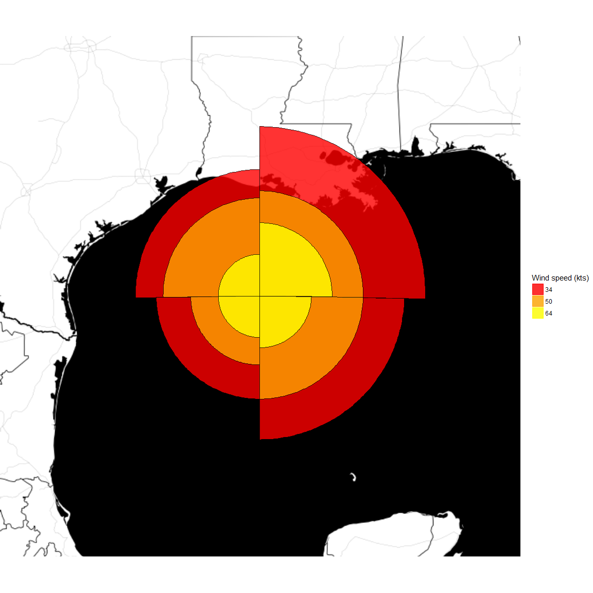
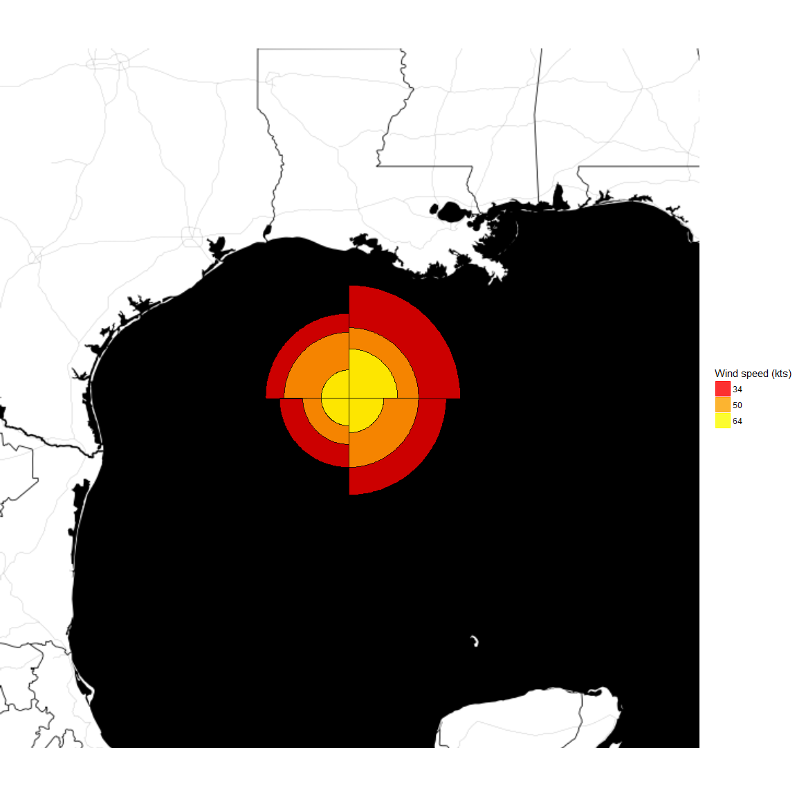
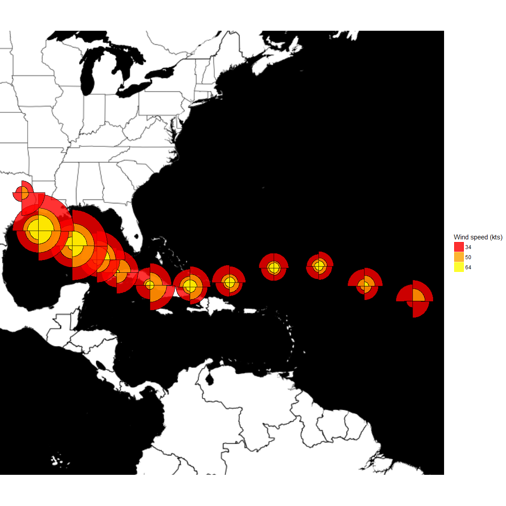

The purpose of this project was to demonstrate understanding of the topics covered in the Building Data Visualization Tools course in the Masterin Software Development in R specialization on Coursera, offered by Johns Hopkins University. To do this I created a series of functions that are meant to solve the following problem (as stated in the course):

*"Hurricanes can have asymmetrical wind fields, with much higher winds on one side of a storm compared to the other. Hurricane wind radii report how far winds of a certain intensity (e.g., 34, 50, or 64 knots) extended from a hurricane's center, with separate values given for the northeast, northwest, southeast, and southwest quadrants of the storm. The 34 knot radius in the northeast quadrant, for example, reports the furthest distance from the center of the storm of any location that experienced 34-knot winds in that quadrant.*

*This wind radii data provides a clearer picture of the storm structure than the simpler measurements of a storm's position and maximum winds. For example, if a storm was moving very quickly, the forward motion of the storm might have contributed significantly to wind speeds to the right of the storm's direction of forward motion, and wind radii might be much larger for the northeast quadrant of the storm than the northwest quadrant. These wind radii are available for Atlantic basin tropical storms since 1988 through the Extended Best Track dataset, available [here](http://rammb.cira.colostate.edu/research/tropical_cyclones/tc_extended_best_track_dataset/)."*

Approach
--------

There are 2 functions in this project that can be used to construct the relevant geom for mapping the wind intensity data.

-   `geocode_radii(point,arc,radius,conv,scale)` takes locational data and wind distances, and geocodes points on which the resulting polygons for mapping are based.
-   `geom_hurricane()` creates a layer on a `ggplot2` or `ggmap` output, displaying a hurricane wind geom.

They are both in the `Wind_Radii_Geom.R` file in the `R\` folder. Also included in the same file is the `ggproto` object `GeomHurricane`, which is the construction of the hurricane wind geom itself.

There is also a separate function for extracting and tidying the specific data used for testing the geom functions, called `get_stormdata(file)`. The test data used needed quite a bit of cleaning and sorting, so for details on how that was accomplished, please look at this function and its accompanying documentation.

Finally, all of these functions and objects were built using a plethora of libraries. They are listed below, and will need to be installed on your system prior to running the functions.

``` r
library(readr)
library(dplyr)
library(tidyr)
library(stringr)
library(lubridate)
library(geosphere)
library(ggplot2)
library(grid)
library(ggmap)
```

Examples
--------

Below are several examples of the functionality provided by this project, using data from Hurricane Ike. The first and second maps show the hurricane at the same point in time; however, the second map is simply scaled down using the `scale_radii` aesthetic.

The final map shows the versatility of the functions provided by mapping the entire route of Hurricane Ike, using the noon locations from each day of its existance.

The relevant code to create these maps is also shown.

### **- Hurricane Ike's wind speed map at noon on September 9th, 2012**

``` r
Ike_sample<-ext_tracks_cleaned%>% #subset for data for first two graphs
    dplyr::filter(storm_id=="Ike-2008",date==lubridate::ymd_hms("2008-09-12 12:00:00"))%>%
    dplyr::arrange(date,wind_speed)%>%
    dplyr::mutate(id=1:n()) #for grouping if necessary

Ike_location<-unique(c(Ike_sample$longitude,Ike_sample$latitude)) #find lat and lng, so no guessing

#base map
Ike_base2<-ggmap::get_map(location=c(lon=Ike_location[1],lat=Ike_location[2]),zoom=6,maptype="toner-background")

#full map 1
map2<-Ike_base2%>%ggmap::ggmap(extent="device")+
    geom_hurricane(data=Ike_sample,
                   ggplot2::aes(x=longitude,y=latitude,r_ne=ne,r_se=se,r_nw=nw,r_sw=sw,
                                fill=wind_speed,color=wind_speed,group=id))+
    ggplot2::scale_color_manual(name="Wind speed (kts)",values=c("red","orange","yellow"))+
    ggplot2::scale_fill_manual(name="Wind speed (kts)",values=c("red","orange","yellow"))

map2
```



### **- Hurricane Ike's wind speed map at noon on September 9th, 2012, with it's radius reduced to half**

``` r
#full map 2
map3<-Ike_base2%>%ggmap::ggmap(extent="device")+
    geom_hurricane(data=Ike_sample,
                   ggplot2::aes(x=longitude,y=latitude,r_ne=ne,r_se=se,r_nw=nw,r_sw=sw,
                                fill=wind_speed,color=wind_speed,group=id,scale_radii=0.5))+
    ggplot2::scale_color_manual(name="Wind speed (kts)",values=c("red","orange","yellow"))+
    ggplot2::scale_fill_manual(name="Wind speed (kts)",values=c("red","orange","yellow"))

map3
```



### **- Whole path of the Hurricane Ike at noon on each day it was active**

``` r
Ike_track<-ext_tracks_cleaned%>% #subset for several outputs, to show path
    dplyr::filter(storm_id=="Ike-2008",lubridate::hour(date)==18,latitude<40)%>%
    dplyr::arrange(date,wind_speed) %>%
    dplyr::mutate(id=1:n())

#this base map did require some guessing, since we don't have a single output
Ike_base1<-ggmap::get_map(location=c(lon=-70,lat=25),zoom=4,maptype="toner-background")

#full map 3
map1<-Ike_base1%>%ggmap::ggmap(extent="device")+
    geom_hurricane(data=Ike_track,
                   ggplot2::aes(x=longitude,y=latitude,r_ne=ne,r_se=se,r_nw=nw,r_sw=sw,
                                fill=wind_speed,color=wind_speed,group=id))+
    ggplot2::scale_color_manual(name="Wind speed (kts)",values=c("red","orange","yellow"))+
    ggplot2::scale_fill_manual(name="Wind speed (kts)",values=c("red","orange","yellow"))

map1
```



Appendix
--------

This geom and this readme were created during an RStudio session with the following specs:

``` r
sessionInfo()
#> R version 3.4.1 (2017-06-30)
#> Platform: x86_64-w64-mingw32/x64 (64-bit)
#> Running under: Windows 10 x64 (build 15063)
#> 
#> Matrix products: default
#> 
#> locale:
#> [1] LC_COLLATE=English_United States.1252 
#> [2] LC_CTYPE=English_United States.1252   
#> [3] LC_MONETARY=English_United States.1252
#> [4] LC_NUMERIC=C                          
#> [5] LC_TIME=English_United States.1252    
#> 
#> attached base packages:
#> [1] grid      stats     graphics  grDevices utils     datasets  methods  
#> [8] base     
#> 
#> other attached packages:
#>  [1] bindrcpp_0.2    ggmap_2.6.1     ggplot2_2.2.1   geosphere_1.5-5
#>  [5] sp_1.2-5        lubridate_1.6.0 stringr_1.2.0   tidyr_0.7.1    
#>  [9] dplyr_0.7.3     readr_1.1.1    
#> 
#> loaded via a namespace (and not attached):
#>  [1] Rcpp_0.12.12      compiler_3.4.1    plyr_1.8.4       
#>  [4] bindr_0.1         tools_3.4.1       digest_0.6.12    
#>  [7] evaluate_0.10.1   tibble_1.3.4      gtable_0.2.0     
#> [10] lattice_0.20-35   pkgconfig_2.0.1   png_0.1-7        
#> [13] rlang_0.1.2       mapproj_1.2-5     yaml_2.1.14      
#> [16] proto_1.0.0       knitr_1.17        maps_3.2.0       
#> [19] RgoogleMaps_1.4.1 hms_0.3           rprojroot_1.2    
#> [22] glue_1.1.1        R6_2.2.2          jpeg_0.1-8       
#> [25] rmarkdown_1.6     reshape2_1.4.2    purrr_0.2.3      
#> [28] magrittr_1.5      codetools_0.2-15  backports_1.1.0  
#> [31] scales_0.5.0      htmltools_0.3.6   assertthat_0.2.0 
#> [34] colorspace_1.3-2  labeling_0.3      stringi_1.1.5    
#> [37] lazyeval_0.2.0    munsell_0.4.3     rjson_0.2.15
```
